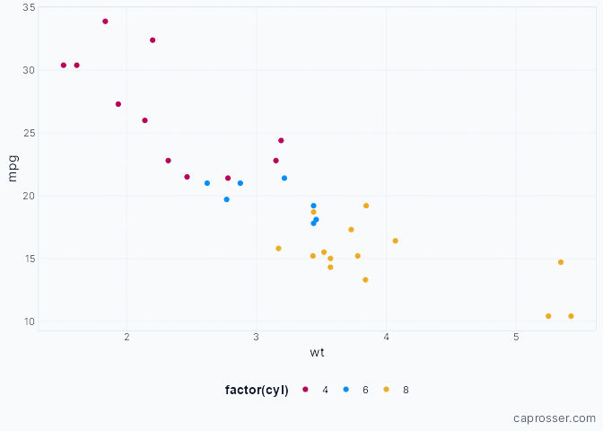

<!-- README.md is generated from README.Rmd. Please edit that file -->

# chrisplot

<!-- badges: start -->

<!-- badges: end -->

This is a collection of themes, palettes, and helper functions I use to
make plots using `ggplot2`.

## Installation

You can install the development version of chrisplot like so:

## Install

``` r
# install.packages("remotes")

remotes::install_github("drcaprosser/chrisplot")
```

## Example

``` r
library(ggplot2)
library(chrisplot)

ggplot(mtcars, aes(wt, mpg, colour = factor(cyl))) +
 geom_point() +
 theme_chris() +
  chris_note()
```


