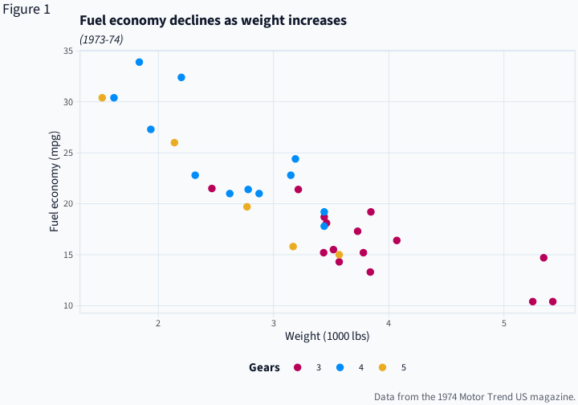
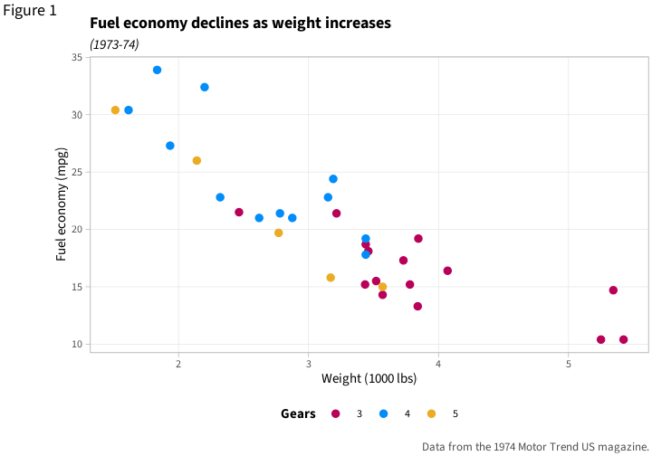
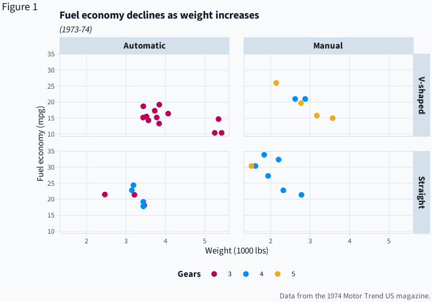
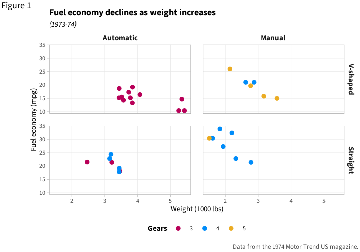
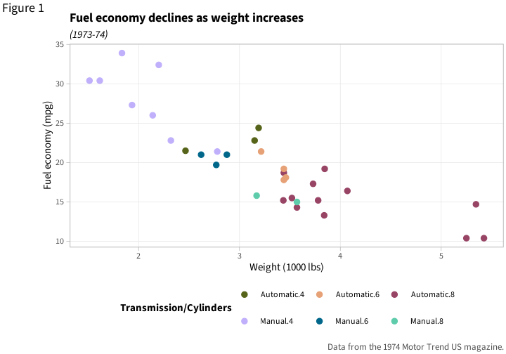

<!-- README.md is generated from README.Rmd. Please edit that file -->

# chrisplot

<!-- badges: start -->

<!-- badges: end -->

This is a collection of themes, palettes, and helper functions I use to
make plots using `ggplot2`.

## Installation

I made this for myself, but if you want, you can install chrisplot like
so:

``` r
# install.packages("remotes")

remotes::install_github("drcaprosser/chrisplot")
```

## Themes

``` r


mtcars2 <- within(mtcars, {
  vs <- factor(vs, labels = c("V-shaped", "Straight"))
  am <- factor(am, labels = c("Automatic", "Manual"))
  cyl  <- factor(cyl)
  gear <- factor(gear)
})

p1 <- ggplot(mtcars2) +
  geom_point(aes(x = wt, y = mpg, colour = gear)) +
  labs(
    title = "Fuel economy declines as weight increases",
    subtitle = "(1973-74)",
    caption = "Data from the 1974 Motor Trend US magazine.",
    tag = "Figure 1",
    x = "Weight (1000 lbs)",
    y = "Fuel economy (mpg)",
    colour = "Gears"
  )

# theme_chris
p1 + theme_chris()
```



``` r

# theme_academic
p1 + theme_academic()
```



``` r

# Facetting 

p2 <- p1 + facet_grid(vs ~ am)

p2 + theme_chris()
```



``` r

p2 + theme_academic()
```



## Palettes

A series of ‘optimial’ colour palettes created by [Anton
Tsitsulin](https://tsitsul.in/blog/coloropt/). By default `chrisplot`
used a slightly reordered version of Tsitsulin’s 12 colour normal
palette (reordered because mostly I have plots with only a couple of
categories and I like the red and blue colours better than the yellow).
I also like the fancy palette. I don’t really use the others but
included them for completeness.

``` r
p2 <- ggplot(mtcars2) +
  geom_point(aes(x = wt, y = mpg, colour = interaction(am,cyl))) +
  labs(
    title = "Fuel economy declines as weight increases",
    subtitle = "(1973-74)",
    caption = "Data from the 1974 Motor Trend US magazine.",
    tag = "Figure 1",
    x = "Weight (1000 lbs)",
    y = "Fuel economy (mpg)",
    colour = "Transmission/Cylinders"
  ) +
  theme_academic()


# Default chris_palette (reorded opt_norm_palette_12)
p2 
```


``` r

# Normal palette
p2 + scale_colour_manual(values = opt_norm_palette_6)
```


``` r

# Bright palette
p2 + scale_colour_manual(values = opt_bright_palette)
```


``` r

# Dark palette
p2 + scale_colour_manual(values = opt_dark_palette)
```


``` r

# Fancy palette
p2 + scale_colour_manual(values = opt_fancy_palette)
```



``` r

# Tarnish palette
p2 + scale_colour_manual(values = opt_tarnish_palette)
```


